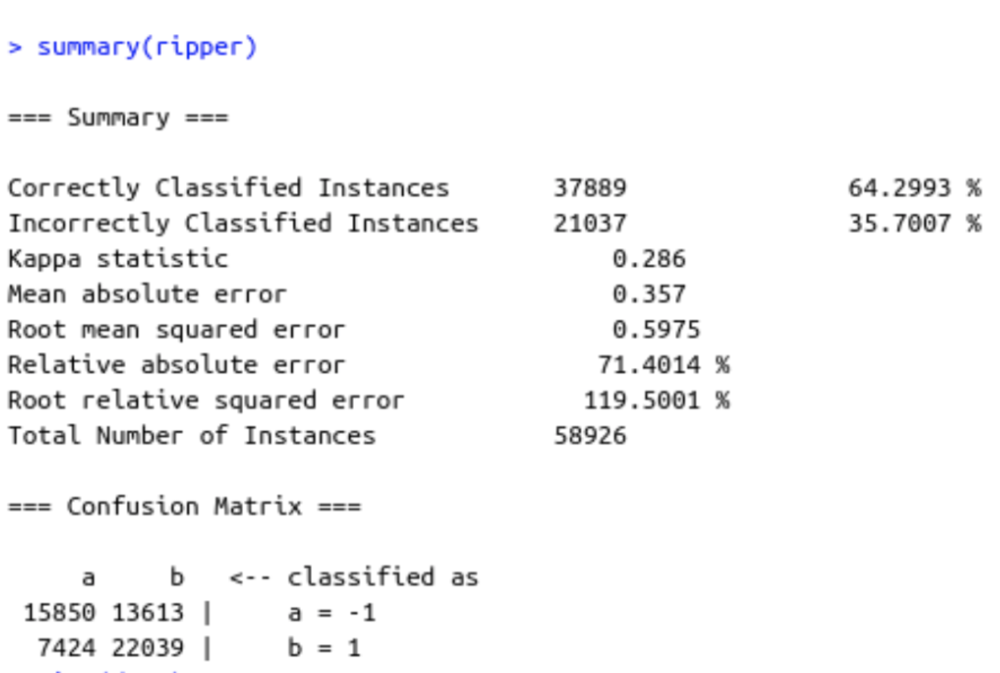

```{r setup, include=FALSE}
knitr::opts_chunk$set(echo = TRUE)
```

**Abstract:**
Avoid death, or trying to postpone it, has always been a relevant topic for the human curiosity, a kind of goal for humanity. In this research, global death data has been gathered and analysed: how death is affecting individuals regarding his sex, age group and nationality and which cause of death has led them to death. First, an exploratory analysis has been carried out to show the data graphically in order to understand it faster and better and visualize relationships between the variables. Second, a prediction model have been developed to predict which cause has led an individual to die, given his age group, sex and nationality.

**Introduction:**
Finding patterns that help to determine certain types of causes of death, aiming to understand death better and prolong the life expectancy of people as well as help living people in the healthiest possible way, is a motivation to contribute to the world to make it a better place to live. This can be done by determining demographic characteristics, such as which causes of deaths are frequently affecting a certain group of people, and determining some type of solution for it. 
Next, some related works on this topic are exposed and commented:
-Causes Of Deaths, by Hannah Ritchie and Max Roser, published on February 2018. The link to the article is <https://ourworldindata.org/causes-of-death>. It is related to the worldwide causes of deaths in 2017, 
-Trends in cause-specific mortality among children aged 5–14 years from 2005 to 2016 in India, China, Brazil, and Mexico: an analysis of nationally representative mortality studies, by Shaza A Fadel, PhD, Prof Cynthia Boschi-Pinto, ScD ,Prof Shicheng Yu, PhD ,Luz Myriam Reynales ,Shigematsu, MD, Geetha R Menon, PhD ,Leslie Newcombe, BSc ,Kathleen L Strong, PhD Qiqi,Wang, MSc,Prof Prabhat Jha, DPhil . Published on March 2019, the link to the article is <https://www.thelancet.com/journals/lancet/article/PIIS0140-6736(19)30220-X/fulltext>. The study is specially focused on mortality causes on children.
-The Swedish cause of death register by Hannah Louise Brooke,Mats Talbäck, Jesper Hörnblad, Lars Age Johansson, Jonas Filip Ludvigsson, Henrik Druid,8 Maria Feychting, and Rickard Ljung, published on 2017 October 5. The link to the article is <https://www.ncbi.nlm.nih.gov/pmc/articles/PMC5662659/> . The study aims to understand the causes of deaths in Sweden, and classify them.
 
-Cause-specific mortality patterns among hospital deaths in Tanzania, 2006-2015, by Leonard E. G. Mboera  ,Susan F. Rumisha ,Emanuel P. Lyimo, Mercy G. Chiduo, Chacha D. Mangu, Irene R. Mremi, Claud J. Kumalija, Catherine Joachim, Coleman Kishamawe, Isolide S. Massawe, Lucas E. Matemba, Evord Kimario, Veneranda M. Bwana, Denna M. Mkwashapi, published on October 31, 2018. The link to the article is <https://journals.plos.org/plosone/article?id=10.1371/journal.pone.0205833>. The study aims to understand the causes of inpatient mortality in hospitals and is important for monitoring the population health and evidence-based planning for curative and public health care.
Identifying Causes for Excess Mortality in Patients With Diabetes: Closer but Not There Yet, by
Oriana Hoi Yun Yu , published on November 2016, The link to the article is
<https://care.diabetesjournals.org/content/39/11/1851>. The study aims to understand the diabetes  disease associated with increased morbidity and mortality.

In general, all the aforementioned articles have as a general goal explaining death due to some cause or disease. So the general idea is to conduct an exploratory analysis of the causes and be able to observe them in a general way.


People die more frequently as the ID number for the Cause of Death is higher: Higher ID causes of death have a greater mortality rate. There seems that there is not difference between males and females given a specific cause of death ID.
20
Infectious and parasitic diseases
380
Respiratory Infectious 
420
Maternal conditions
490
Neonatal conditions
540
Nutritional deficiencies
610
Malignant neoplasms
790
Other neoplasms
800
Diabetes mellitus
810
Endocrine, blood, immune disorders
820
Mental and substance use disorders
940
Neurological conditions
1020
Sense organ diseases
1100
Cardiovascular diseases
1170
Respiratory diseases
1210
Digestive diseases
1260
Genitourinary diseases
1330
Skin diseases
1340
Musculoskeletal diseases
1400
Congenital anomalies
1470
Oral conditions
1505
Sudden infant death syndrome
1520
Unintentional injuries
1600
Intentional injuries


Males tend to die more frequently for each Age Group, except for the 70+ group, where Females die more than Males.


This visualization shows that people tend to die as its age is becoming higher. Moreover, people also die more frequently when they are 4 years or lower. The bar corresponding to 30-49 is bigger than the other ones: this is explained as this group gathers people from a wider range than the other groups.


Annual deaths are higher for males than for females.


This is a sample of the total data: to visualize number of deaths per country is easier if a little sample is taken, as representing 183 different countries can be unclear and confusing. 
Given this graph, it is clear that India and China have a greater death rate as their total population is much higher than the other ones; Russian Federation has also a high death number as its population is also higher than the other ones. For the other countries, the death rate is very similar, but the rate is higher for developed countries as France, Italy and Spain as the death registry is more reliable as well as the rate is higher as the total population becomes higher.

**Methods:**
Our Questions of interest were:
Which are the deadliest causes of death?

For respond this question we did a plot, in the R Programming Language, , with the ggplot2 Library to create plots, and comparing in our data set, comparing the Sex as the independent Variable, and the Causes of Death as the Dependent Variable, with that the deadliest cause of the appeared.


Are there any difference between ages and sexes?

also for respond this question , a plot was did, in the R programming Language, with the ggplot2 library, to create plots, comparing in our data set the Age group as the independent Variable and the Number of Deaths as the dependent Variable.

Given an individual profile (age range, country and cause of death) which is the most possible gender?

For answering this machine learning oriented question, we used a RIPPER classification algorithm (supervised learning) by using the following R code:

library(RWeka)
data$Sex<-as.factor(data$Sex)
ind<- sample(2, nrow(data), replace = T, prob = c("0.8","0.2"))
train<-data[ind== 1, ]
test<-data[ind== 2, ]
ripper<-OneR(Sex~ ., data = data)
summary(ripper)

RIPPER is a rule-based learner that builds a set of rules that identify the classes while minimizing the amount of error. The error is defined by the number of training examples misclassified by the rules.

For making the predictions, wi will introduce to the model the three values of the 
age range, country and cause of death variables and get the most probable gender as the result.

**Results:**
Which are the deadliest causes of death?


As can be observed in the Plot the deadliest Cause of Death is the number 1600, that is the code number for “Intentional Injuries”
Are there any difference between ages and sexes?


For Age group on both Sexes is visible observed that have the same tendency, but is also observable that Males are more affected.

Given an individual profile (cause of death, age range and country) which is the most possible gender?

When applying the mentioned RIPPER algorithm in R we get the following output, meaning that the built model will predict with a 64% accuracy which is too low. This can be caused by a lack of variables in the model. We can fix this by adding new variables or changing the algorithm.




**Discussion and Future Work:**

What are the real world implications of your results, and what further work should be done in this area based on your insights?

The result of this work is a classification model to know the sex of a dead individual given its age group, nationality and cause of death. Further work could include a model for knowing the cause of death given the sex, age group and nationality of an individual.

